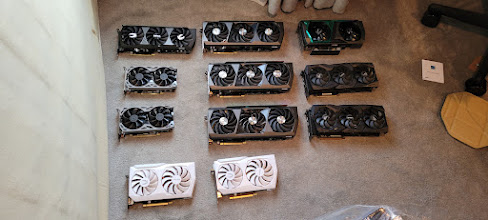
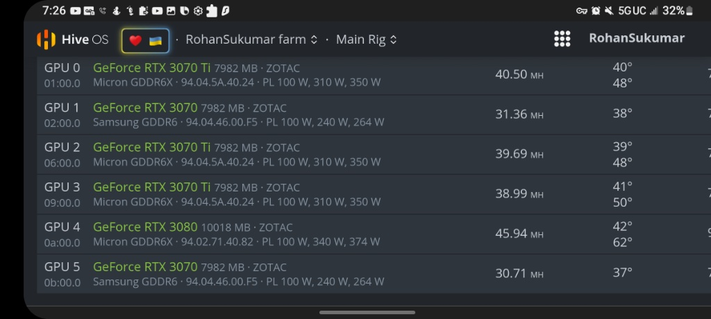
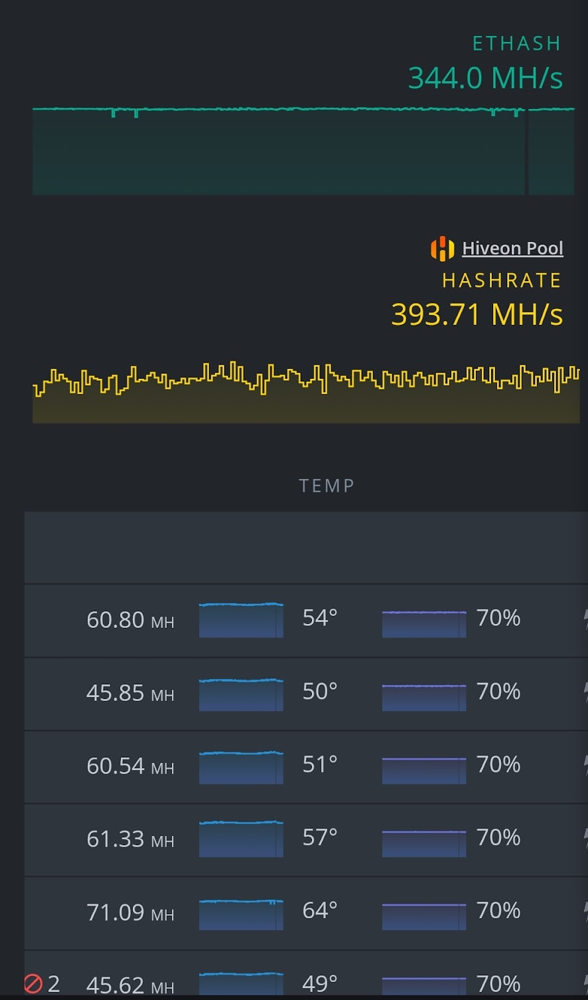
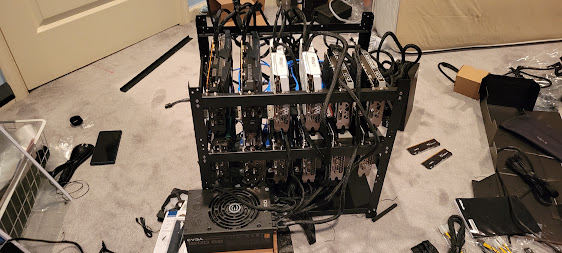
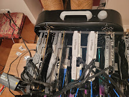
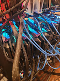
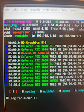

# Ethereum GPU Mining Rig

A custom-built, multi-GPU Ethereum mining rig built during the 2021–2022 crypto boom. The project combined sourcing scarce graphics cards, flashing custom VBIOSes, overclocking, managing the rig remotely with Hive OS, and upgrading household electrical infrastructure to handle the power draw.

## Project Overview

This project started in 2021, when crypto was booming and Ethereum was still a proof-of-work coin. That meant graphics cards could be used to mine it, and a well-optimized rig had the potential to pay itself off quickly. A friend and I spent a lot of time researching rig designs, mining software, and pools, and eventually decided to build our own.

The biggest obstacle was getting the hardware. Graphics cards were in extremely short supply because of COVID-related supply chain issues and heavy demand from miners. To get around this, we set up an automated alert service that notified us whenever specific GPUs were listed for sale, and we bought both new and used cards as soon as they appeared. In total, we collected roughly a dozen cards, all-in on hardware for approximately $5,000, which was reasonable for the time.

After a lot of testing and iteration, the rig booted and began mining stably.

The full collection of graphics cards laid out before installation

## Features

- Open-air mining frame holding multiple GPUs
- Mix of NVIDIA RTX 30-series cards, sourced both new and used
- Custom VBIOS flashed onto cards to improve hash rate
- Overclocked and power-limited cards, tuned individually
- Workaround for the Lite Hash Rate (LHR) limiter on newer cards
- Managed remotely through Hive OS
- Mined through Hiveon Pool for steady, consistent payouts
- Dedicated 20 amp circuit for the rig
- Server rack-mounted UPS for backup power

## Parts Used

- Open-air GPU mining frame
- EVGA power supply
- Multiple NVIDIA GeForce GPUs (see below)
- PCIe risers and power cabling
- Server rack-mounted UPS (battery backup)
- Dedicated 20 amp breaker and circuit
- Hive OS for rig management and monitoring

### GPUs Shown in the Hive OS Dashboard

All of the cards below are ZOTAC models.

| GPU | VRAM | Memory | Hash Rate |
|---|---|---|---|
| RTX 3070 Ti | 8 GB | Micron GDDR6X | 40.50 MH/s |
| RTX 3070 | 8 GB | Samsung GDDR6 | 31.36 MH/s |
| RTX 3070 Ti | 8 GB | Micron GDDR6X | 39.69 MH/s |
| RTX 3070 Ti | 8 GB | Micron GDDR6X | 38.99 MH/s |
| RTX 3080 | 10 GB | Micron GDDR6X | 45.94 MH/s |
| RTX 3070 | 8 GB | Samsung GDDR6 | 30.71 MH/s |

Hive OS GPU list showing per-card hash rate, temperature, memory type, and power limits

## Design

The project came together in four main areas:

1. **Sourcing hardware**
   Cards were scarce, so we automated the search. The alert service watched listings for the specific GPUs we wanted and notified us right away, which let us buy cards (new and used) before they sold out.

2. **Software and mining setup**
   Rather than mining solo, the rig runs on Hive OS and mines through Hiveon Pool. This is explained in more detail below.

3. **GPU optimization**
   Each card was flashed with a custom VBIOS, overclocked, and power-limited to maximize hash rate per watt.

4. **Power infrastructure**
   A rig this size pulls far more power than a normal household circuit is meant to handle, so the electrical setup had to change before it could run reliably.

## Mining Approach

Mining works by having hardware repeatedly compute guesses until one of them solves the current block. The miner who solves it earns the block reward. Mining solo, a small rig would have an extremely low chance of ever landing a block, so it is essentially like buying a lottery ticket. We decided early on that this was not a realistic way to profit.

Instead, we mined through a pool. In a pool, many miners combine their hash rate and split the rewards in proportion to the work each one contributes. Payouts are much smaller, but they are steady and predictable. We managed the rig with **Hive OS**, a mining operating system for monitoring and configuring rigs remotely, and pointed it at **Hiveon Pool**.

### Hash Rate Optimization

Hash rate is the number of calculations a GPU can perform per second, and it directly determines how much a card earns. We used a few techniques to push each card as far as it would go:

- **Overclocking and power limiting:** Memory clocks were raised and core clocks and power limits were lowered, since Ethereum mining depends heavily on memory speed and not much on core speed. This increased hash rate while cutting power draw.
- **Custom VBIOS:** We flashed modified VBIOSes onto individual GPUs to improve memory timings and hash rate.
- **LHR workaround:** Newer NVIDIA cards shipped with Lite Hash Rate limiters designed to cut Ethereum hash rate roughly in half. We found and used software that bypassed the limit so those cards could perform closer to their real capability.

Hive OS dashboard showing the Ethash hash rate graph, Hiveon Pool hash rate, and per-card temperatures and fan speeds

## Power Infrastructure

Once we started mining, we ran into a problem immediately. The rig was not efficient at first because its power draw was too high, and the existing circuit did not have enough capacity. At full load the rig drew roughly 2,000 watts.

To fix this, we installed a dedicated line on the breaker and upgraded it from 15 amps to 20 amps, which gave the rig enough headroom to run without tripping.

We also added a **server rack-mounted UPS**, which is a backup battery power supply. This keeps the rig running through short power outages and protects the hardware from sudden shutdowns.

## Build Process

The open-air frame with GPUs mounted and the EVGA power supply below, mid-build with parts and packaging still on the floor

Top view of the rig with GPUs installed and connected

Close-up of the wiring. Every card needs its own power and data connections, so cable management became a real challenge

Checking the rig from the terminal, with each GPU detected and the rig connected to the local network

## Results

Once everything was tuned, the rig ran consistently. The Hive OS dashboard shows the Ethash hash rate holding steady around 344 MH/s, and the pool reporting around 393.71 MH/s. Individual cards ran at temperatures between roughly 37°C and 64°C, with the fans set to 70%.

The stable hash rate graph was the main indicator that the tuning, cooling, and power setup were working.

## Challenges

Some of the main challenges included:

- Finding GPUs during a global shortage
- Buying used cards without knowing how they had been treated
- Getting a stable overclock on every card, since each one behaved differently
- Working around the LHR limiter on newer cards
- Managing power draw that exceeded what a normal household circuit could handle
- Keeping the rig cool and organized with so many cables and cards in a small space
- Keeping the rig online during power interruptions

## Final Result

The rig ended up as a stable, remotely managed mining setup with tuned cards, a dedicated power line, and battery backup. It ran on Ethereum until the network's transition away from proof of work.

## The Merge

In September 2022, Ethereum switched from proof of work to proof of stake in an event known as the Merge. After that, GPUs could no longer mine Ethereum, which ended the main purpose of the rig, so we stopped mining at that point.

## What I Learned

Through this project, I learned more about:

- How proof-of-work mining actually works, and why pooling makes sense for small miners
- Managing and monitoring hardware remotely with Hive OS
- Overclocking, undervolting, and power limiting GPUs for efficiency
- Flashing VBIOSes and the risks that come with it
- Building automated tools to find scarce hardware
- Household electrical limits, breakers, and dedicated circuits
- Cable management, cooling, and airflow for dense hardware
- Planning around a market I had no control over, and knowing when it was time to stop
